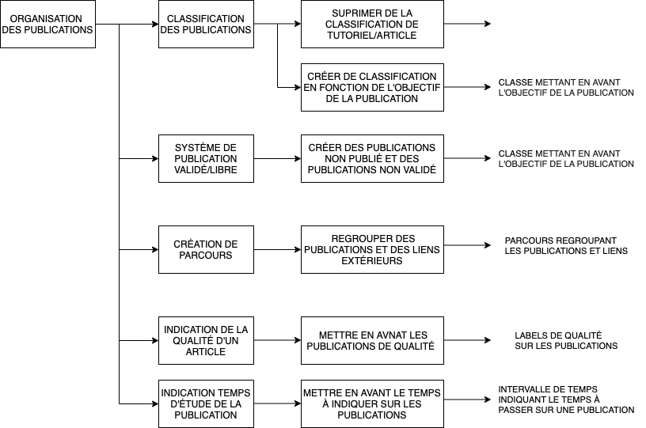
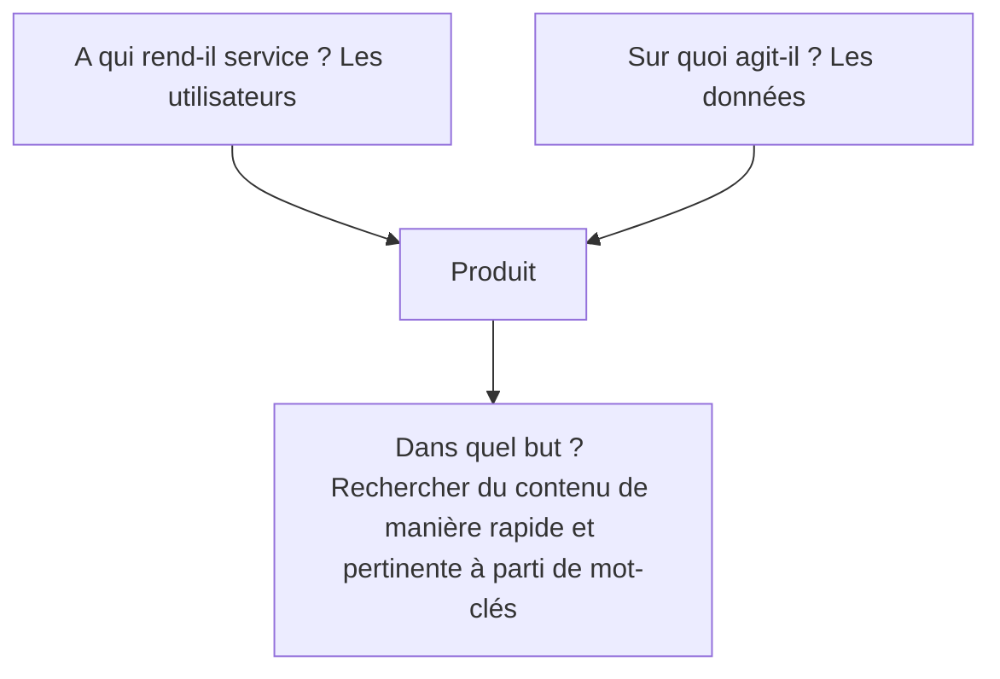
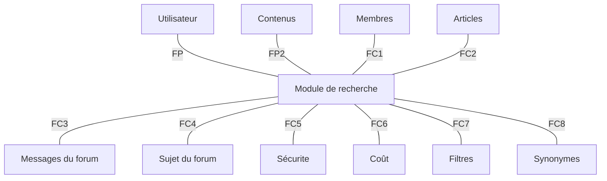
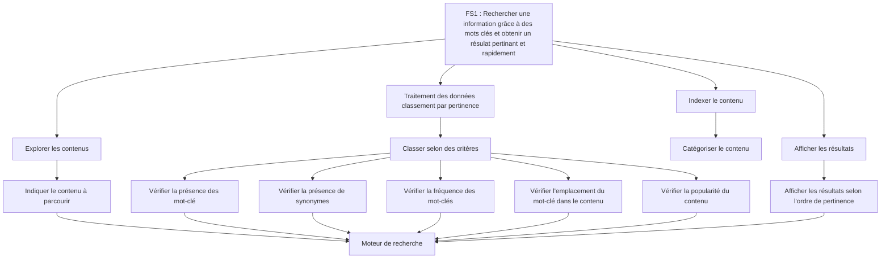

---
title: "Cahier des charges"
...

# Cahier des charges Module de recherche

## Analyse fonctionnelle de l’organisation des publications

Pour qui ?

- visiteurs 
- auteurs 
- modérateurs 
- validateurs 

But : simplifier le partage et la gestion des publications pour tous les acteurs cités
précédemment

| Fonction  | Priorité         | Objectif |
| :--------------- |:---------------| :-----|
| Classification  |   Essentiel        |  Besoin de rechercher + efficacement |
| Validation  | Essentiel             |  certifier un contenu |
| Système Bêta  | Essentiel          |    Permettre aux adhérents de tester des publications → validation |
| Parcours | Complémentaire          | Permettre aux utilisateurs de regrouper les contenus par thématique. |
| Label | Complémentaire          | Besoin de certifier par l’équipe de la qualité de la publication |
| Ajout du temps estimé | Complémentaire          | Permettre à l'auteur d’indiquer le temps d’étude estimé de la publication |

## Diagramme FAST

### Faisabilité technique 
- concernant le backend des publications, c’est essentiellement supprimer des
contraintes existantes 
- concernant l’interface, il faudra ajouter les pages par grands domaines et les
formulaires pour les modifier

## Évolution du module de recherche 
### Bête à cornes (qui permet d’exprimer la recherche du besoin.)

### Diagramme Pieuvre 

| Id fonction  | Explication          | 
| :--------------- |:---------------:| 
| FC1  |   Rechercher un membre        | 
| FC2  |   Rechercher un article        | 
| FC3  |   Rechercher un message de forum        | 
| FC4  |   Rechercher un sujet de forum       | 
| FC5  |   Utiliser les dernières versions du module pour éviter des failles      | 
| FC6  |  Minimiser les coûts de l'hébergeur   | 
| FC7  |  Filtrer les résultats   | 
| FC8  |  Ignorer certains mots dans la pertinence des résultats de la recherche   | 
| FC9  |  Créer des synonymes pour une meilleure recherche| 
| FC10  |  Configurer le module de recherche de manière simple et intuitive | 

### Diagramme FAST 

