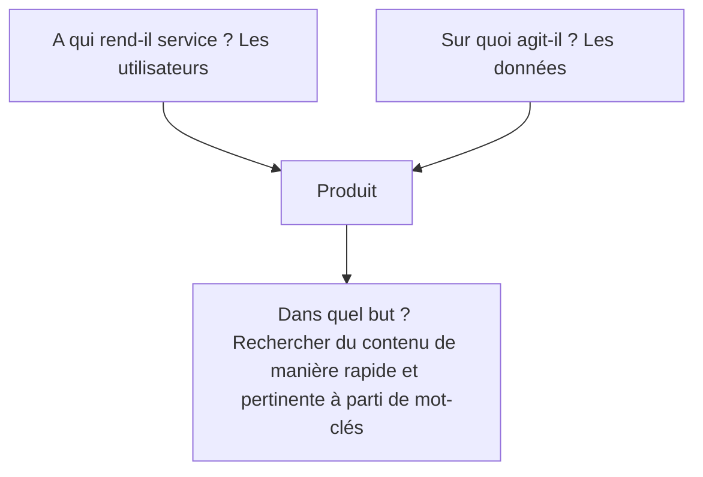
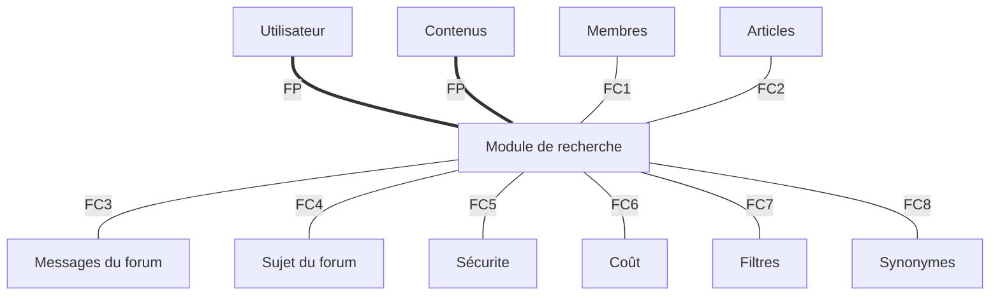
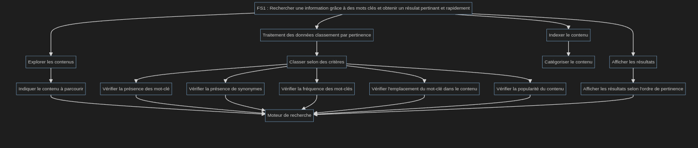
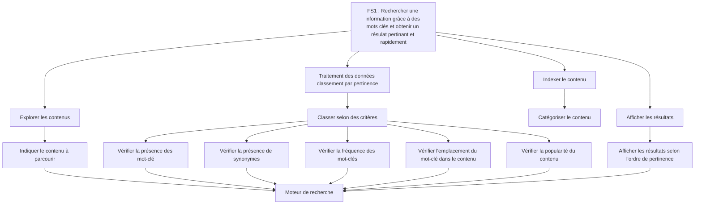

---
title: "Cahier des charges"
...

## Organisation des publications

### Contexte
Récemment, une réflexion a été menée sur l'organisation des contenus (tutoriels, articles et billets), afin qu’elle soit plus facile à comprendre pour les visiteurs et plus souple à utiliser pour les auteurs, modérateurs et validateurs, tout en préservant l’exigence de qualité pour les publications validées et la facilité d’expression actuelle des billets.
Les propositions retenues sont présentées dans un sujet du forum. Ces propositions ont été découpées en différentes tâches à réaliser, visibles sur une page de suivi sur GitHub. Certaines tâches ont été déjà été réalisées. Vous pouvez choisir de travailler sur les tâches qu'il reste à réaliser pour ce chantier.
La majorité de ces tâches ne sont qu'à l'état d'idée ; la façon précise de les implémenter n'est pas encore définie. À vous de faire des propositions, de tester quelles peuvent être les meilleures implémentations, notamment d'un point de vue interface utilisateur.
la recherche avec un moteur de recherche généraliste.

## Analyse fonctionnelle de l’organisation des publications

Pour qui ?

- visiteurs 
- auteurs 
- modérateurs 
- validateurs 

But : simplifier le partage et la gestion des publications pour tous les acteurs cités
précédemment

| Fonction  | Priorité         | Objectif |
| :--------------- |:---------------| :-----|
| Classification  |   Essentiel        |  Besoin de rechercher + efficacement |
| Validation  | Essentiel             |  certifier un contenu |
| Système Bêta  | Essentiel          |    Permettre aux adhérents de tester des publications → validation |
| Parcours | Complémentaire          | Permettre aux utilisateurs de regrouper les contenus par thématique. |
| Label | Complémentaire          | Besoin de certifier par l’équipe de la qualité de la publication |
| Ajout du temps estimé | Complémentaire          | Permettre à l'auteur d’indiquer le temps d’étude estimé de la publication |

## Diagramme FAST

### Faisabilité technique 
- concernant le backend des publications, c’est essentiellement supprimer des
contraintes existantes 
- concernant l’interface, il faudra ajouter les pages par grands domaines et les
formulaires pour les modifier

## Évolution du module de recherche 

### Contexte
Zeste de Savoir utilise Elasticsearch pour la recherche interne sur le site. Elasticsearch permet d'indexer le contenu du site (tutoriels, articles, billets, forums) et récupérer les résultats les plus pertinents pour les présenter à l'utilisateur. Le cœur du site s'interface en Python avec Elasticsearch afin de l'interroger et récupérer les résultats.
Dans son état actuel, le module de recherche de Zeste de Savoir ne correspond pas complètement aux besoins du site :
-    obsolescence de la version d'Elasticsearch utilisée, qui ne répond plus à nos exigences de sécurité ;
-    absence de fonctionnalités désirables, comme la possibilité de rechercher des membres ou d'effectuer des recherches plus fines ;
-    pertinence des résultats non-optimale, qui fait que- la recherche interne du site est rarement au niveau de la recherche avec un moteur de recherche généraliste.

### Bête à cornes (qui permet d’exprimer la recherche du besoin.)

### Diagramme Pieuvre 

| Id fonction  | Explication          | 
| :--------------- |:---------------:| 
| FP  |   Rechercher du contenu de manière rapide et pertinente à parti de mot-clés        | 
| FC1  |   Rechercher un membre        | 
| FC2  |   Rechercher un article        | 
| FC3  |   Rechercher un message de forum        | 
| FC4  |   Rechercher un sujet de forum       | 
| FC5  |   Utiliser les dernières versions du module pour éviter des failles      | 
| FC6  |  Minimiser les coûts de l'hébergeur   | 
| FC7  |  Filtrer les résultats   | 
| FC8  |  Ignorer certains mots dans la pertinence des résultats de la recherche   | 
| FC9  |  Créer des synonymes pour une meilleure recherche| 
| FC10  |  Configurer le module de recherche de manière simple et intuitive | 

### Diagramme FAST 

### Différentes solutions à étudier et à comparer
- [ElasticSearch](https://www.elastic.co/fr/elasticsearch/)
- [Algolia](https://www.algolia.com/fr/)
- [Meilisearch](https://www.meilisearch.com/)
- [Typesense](https://typesense.org/)