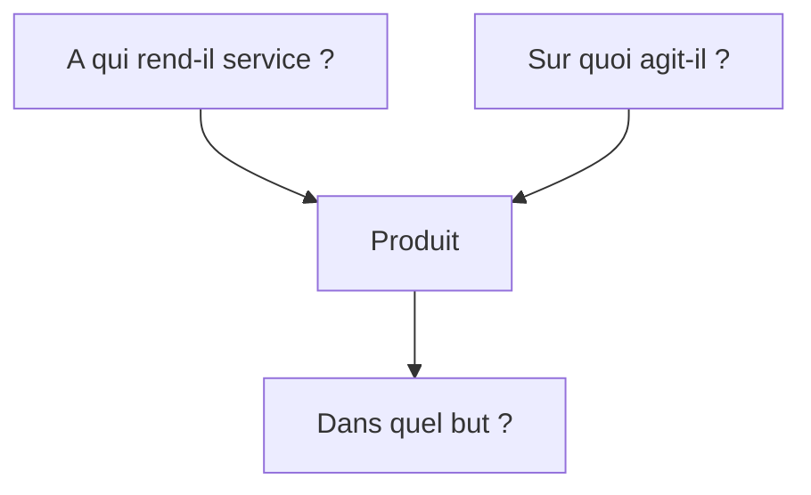
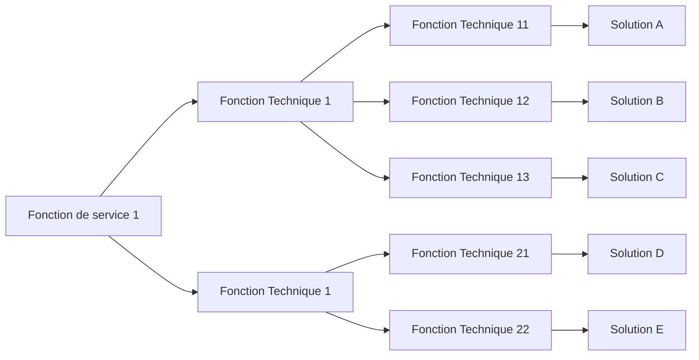

# Cahier des charges 

> [Documentation sur l'analyse fonctionnelle](https://fr.wikipedia.org/wiki/Analyse_fonctionnelle_(conception))

## Bête à cornes (qui permet d’exprimer la recherche du besoin.)

## Diagramme Pieuvre (fonctions de service)

## Diagramme FAST [Documentation](https://fr.wikipedia.org/wiki/Function_analysis_system_technique)

